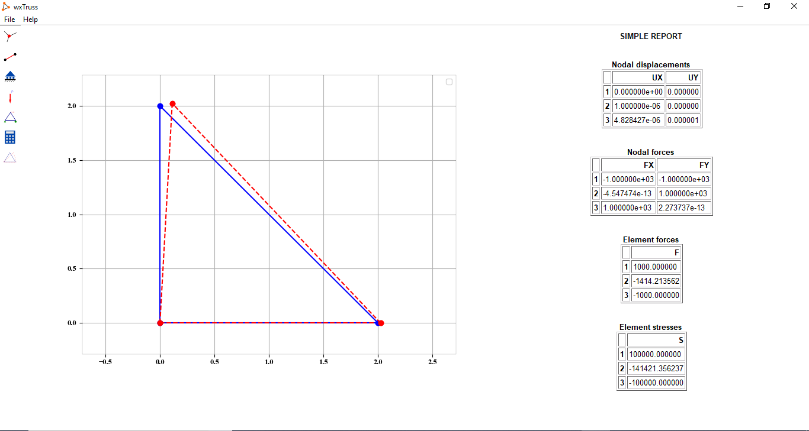

# wxTruss

A simple Python application for 2D-Truss analysis.


## Installation

Using pip:

```
pip install git+https://github.com/JorgeDeLosSantos/wxtruss.git
```

Then, in console run:

```
wxtruss
```

## Versions

Current version: 0.1.0

## Screenshots





## About...

```
Developer: Pedro Jorge De Los Santos
E-mail: delossantosmfq@gmail.com
```
