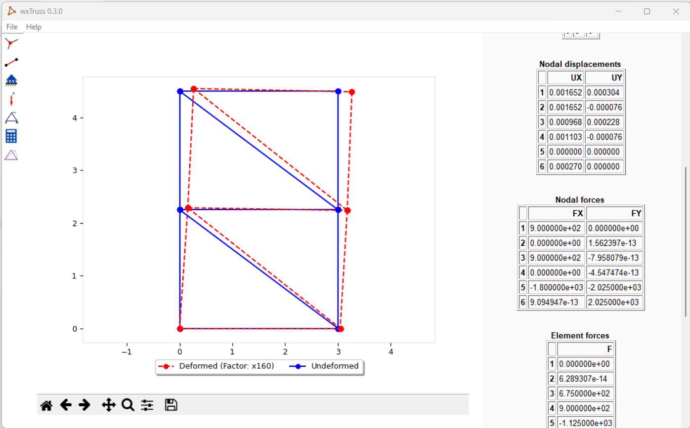

# wxTruss

[](https://www.python.org)
[](https://opensource.org/licenses/MIT)

A simple and intuitive Python application for **2D-Truss analysis** using a graphical user interface.

## Installation

You can install `wxTruss` directly from the GitHub repository using `pip`:

```
pip install git+https://github.com/JorgeDeLosSantos/wxtruss.git
```

Once installed, simply run the following command in your terminal or command prompt:

```
wxtruss
```

## Features 

### Input data

* Nodal coordinates
* Element properties:
    - Connectivity (Ni, Nj)
    - Young Modulus (E)
    - Cross-sectional area (A)
* Boundary conditions (Constraints/supports)
* Applied loads (Nodal forces)

### Output data

* Detailed text report including:
    - Node and element summary.
    - Nodal displacements.
    - Nodal forces
    - Element forces
    - Element stresses
* Plot of both the deformed and undeformed shape of the truss.

## Screenshots

Here is a preview of the application in action:





## About...

```
Developer: Pedro Jorge De Los Santos
E-mail: delossantosmfq@gmail.com
```
